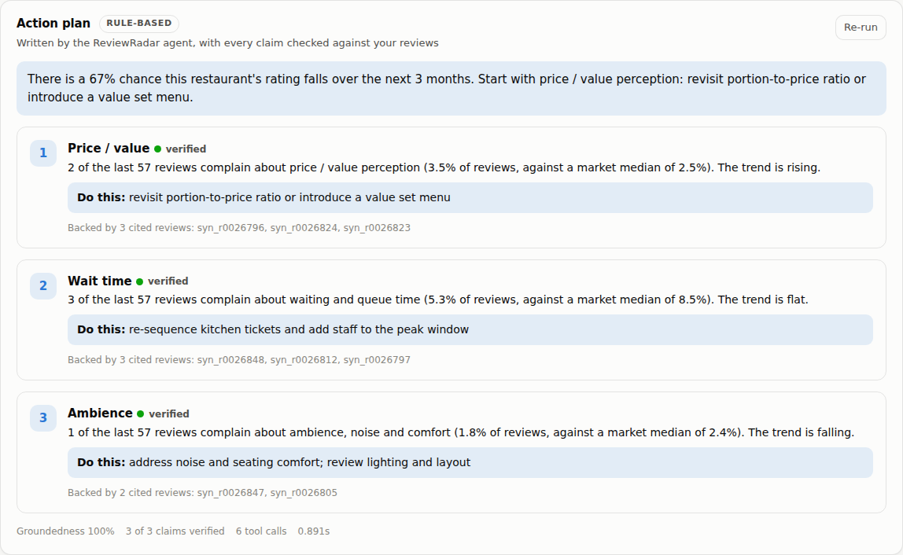

# ReviewRadar — Agentic AI Early Warning for Restaurant Reputation Decline

A reference implementation ("sample model") for the DSA2111 group project idea:
instead of a basic positive/negative sentiment classifier over Yelp reviews,
this system reads a restaurant's review stream and answers the question a
manager actually has —

> **Is my rating about to fall, why, and which operational problem should I fix first?**

Everything here runs end to end today: `make demo` trains the models on a
bundled simulator, `make serve` opens an owner-facing dashboard at
<http://localhost:8000>, and the same pipeline runs on the real
[Yelp Open Dataset](https://www.yelp.com/dataset) with `--source yelp`.


The M5 agent's plan, with every claim verified against the reviews behind it:



---

## 1. Why this is more than a sentiment model

| Plain sentiment model | This system |
| --- | --- |
| One score per review (positive/negative) | Multi-label **aspect** classification: service, food quality, cleanliness, price/value, wait time |
| Describes the past | **Detects** complaint rates breaking away from a venue's own baseline, and **predicts** rating decline 3 months ahead |
| Output is a chart | Output is a **ranked action list** with attributed risk, estimated star cost and verbatim evidence |
| Evaluated on review-level accuracy | Evaluated on *lead time* (how early the warning fires) and *precision@k* (the operating point a district manager actually uses) |

The claim being made — and tested in `tests/` — is that the star rating is a
**lagging** indicator, while the aspect-level complaint rate is a **leading**
one. The whole architecture follows from that.

---

## 2. System architecture

```
 Yelp reviews (JSON)            Module 1                  Module 2
 ┌──────────────────┐   ┌──────────────────────┐   ┌─────────────────────────┐
 │ business.json    │   │ Aspect classifier    │   │ Emerging-complaint      │
 │ review.json      ├──►│ weak supervision +   ├──►│ detector                │
 │  (or simulator)  │   │ TF-IDF → OvR logreg  │   │ EWMA + robust z-score   │
 └──────────────────┘   └──────────┬───────────┘   └────────────┬────────────┘
                                   │ per-review aspect flags    │ alerts
                                   ▼                            │
                        ┌──────────────────────┐                │
                        │ Business × month     │                │
                        │ panel builder        │                │
                        │ (leak-free windows)  │                │
                        └──────────┬───────────┘                │
                                   │                            │
              Module 3             ▼            Module 4        ▼
        ┌────────────────────────────────┐  ┌──────────────────────────────────┐
        │ Decline predictor              │  │ Cause summariser + prioritiser   │
        │ HistGradientBoosting +         ├─►│ counterfactual attribution,      │
        │ isotonic calibration           │  │ star-impact ridge, effort weights│
        └────────────────────────────────┘  └───────────────┬──────────────────┘
                                                            ▼
                                     FastAPI service  ·  Docker  ·  Kubernetes
                                     /alerts  /businesses/{id}/report  /analyse
```

### Module map (proposal M1–M6 → code)

| Module | Proposal | Where it lives |
| --- | --- | --- |
| **M1** | Ingestion & storage: filter restaurants, clean text, monthly per-restaurant features | `data/loader.py`, `data/inspect.py`, `features/panel.py` |
| **M2** | Aspect classifier: aspect + sentiment per review | `models/aspect_classifier.py` |
| **M3** | Trend detector: rolling z-scores on negative aspect mentions | `models/complaint_detector.py` |
| **M4** | Decline forecaster: gradient boosting + per-aspect attribution | `models/decline_predictor.py`, `models/recommender.py` |
| **M5** | **Agent: LLM planner with tool calling, evidence retrieval and a claim verifier** | `agents/` (`tools.py`, `planner.py`, `verifier.py`, `agent.py`) |
| **M6** | Serving & deployment: REST services, owner dashboard, monitoring job | `api/`, `Dockerfile`, `docker-compose.yml`, `k8s/` |

### Module 1 — Aspect classification (`models/aspect_classifier.py`)
Yelp gives stars but no aspect labels, so the model is trained by **weak
supervision**: a seed lexicon produces noisy multi-labels, and a TF-IDF +
one-vs-rest logistic regression is fitted on them. The classifier generalises
past the lexicon while staying cheap enough to retrain nightly in a container.
Polarity comes from the star rating (`stars <= 2` → complaint), which is the
standard Yelp weak-labelling trick; its cost is quantified in the evaluation.

### Module 2 — Emerging complaint detection (`models/complaint_detector.py`)
Each (business, aspect) complaint-rate series is tracked with an EWMA baseline
and a **median-absolute-deviation** scale, giving a robust z-score. Robust
statistics matter here: complaint rates are bounded, skewed and spiky, so a
mean/σ control chart alerts on ordinary noise. Two guards suppress the classic
false positives — a burn-in period, and a minimum absolute complaint count so
"100% of 2 reviews" never fires.

### Module 3 — Rating-decline prediction (`models/decline_predictor.py`)
Binary classification on the business-month panel: will mean stars over months
*t+1…t+3* fall ≥ 0.2 below the trailing mean? Features are level, recent level,
**momentum** (Δ recent vs prior) and **peer-relative** versions of the same
quantities. Two rules are enforced in one place (`features/panel.py`) so they
can be audited: features use only months ≤ *t*, and the split is **chronological**
— a random split leaks the outcome and inflates AUC badly.

### Module 4 — Cause summary and prioritisation (`models/recommender.py`)
For each aspect the system asks the fitted predictor a counterfactual: *what
would this venue's risk be if this aspect sat at the market median and had
stopped deteriorating?* The drop in predicted probability is that aspect's
attributed risk. A separate ridge regression of monthly stars on complaint rates
gives a client-readable star cost ("cleanliness complaints cost ≈1.9 stars per
unit rate"). Priority = (attributed risk + ½ × star cost) ÷ effort weight, so
the recommendation trades impact against how hard the lever is to pull — and
every finding ships with three real review quotes as evidence.

---

## 3. Quickstart

### macOS / Linux

```bash
pip install -r requirements.txt
make demo                 # train on the simulator, then print the top-10 report
make test                 # 40 tests, ~20 seconds
make serve                # dashboard at http://localhost:8000 (API docs at /docs)
```

### Windows (PowerShell)

`make` is not available on Windows by default, so run the same commands
directly. The Makefile is only a shortcut for these.

```powershell
python -m venv .venv
.\.venv\Scripts\Activate.ps1
pip install -r requirements.txt

# Point Python at the package -- this is the one step the Makefile does for you.
# Re-run it in every new terminal session.
$env:PYTHONPATH = "src"

python -m pytest tests -q                                  # = make test
python -m reputation.pipeline.train --source synthetic `
    --n-businesses 120 --months 36                         # = make train
python -m reputation.pipeline.score --top 10               # = make score
python -m uvicorn reputation.api.main:app --reload --port 8000   # = make serve
```

If PowerShell refuses to run the activation script ("running scripts is
disabled on this system"), unblock it for that terminal only:
`Set-ExecutionPolicy -Scope Process -ExecutionPolicy Bypass`.

`pytest` finds the package without `PYTHONPATH` because `pyproject.toml` sets
it, but the `train` and `score` modules need the variable.

### Running on the real Yelp Open Dataset

The dataset is not redistributable and is ~9 GB unpacked, so it is not in this
repository. Download it from <https://www.yelp.com/dataset> (accept the terms,
then take the JSON archive) and unpack it into `./data`, so you have
`data/yelp_academic_dataset_business.json` and
`data/yelp_academic_dataset_review.json`.

Then look before you leap:

```bash
python -m reputation.data.inspect --data-dir data        # or: make inspect
```

This reads only `business.json` and prints how many restaurants each city has,
how many reviews they carry, and a suggested command line. Pick a city from
that list -- one market is the right unit of analysis here, because the
peer-relative features compare a venue against the other venues it competes
with. Then:

```bash
python -m reputation.pipeline.train --source yelp --city Philadelphia
python -m reputation.pipeline.score --top 20 --out artifacts/reports.json
python -m uvicorn reputation.api.main:app --port 8000     # dashboard on real data
```

Add `--limit 200000` for a fast trial run before committing to the full city.

**What to expect.** A large city means a few million review texts: budget a few
GB of RAM while they load, and roughly 5-15 minutes end to end on a laptop.
Running with no `--city` at all works but loads every market into one model;
the trainer warns you when you do. The loader streams both JSON files line by
line, so peak memory is driven by the reviews you keep, not by the file size.

**Verification status.** The `--source yelp` code path is covered by
`tests/test_yelp_loader.py`, which asserts against Yelp's real record format --
the actual key names, `stars` arriving as a float, the
`2018-07-07 22:09:11` timestamp format, null `categories` and `attributes`, and
non-restaurant venues being filtered out. The published numbers in the next
section are still from the bundled simulator; regenerating them on the real
corpus is the group's job, and Section 9 says so.

Containers:

```bash
docker compose up --build         # builds, runs tests, trains, serves on :8000
kubectl apply -f k8s/deployment.yaml
```

The image is multi-stage: the builder runs the test suite and trains the model
bundle, the runtime stage carries only the serving code plus the bundle, runs as
a non-root user, and exposes `/health` for readiness/liveness probes. A
`CronJob` retrains nightly onto a shared volume.

### Sample output

```json
{
  "business_id": "syn_b0059",
  "period": "2024-05",
  "decline_risk": 0.5051,
  "risk_band": "medium",
  "summary": "51% probability of a rating decline over the next 3 months. Largest
              attributable driver is food quality and consistency (52% of recent
              reviews complain, market median 8%). First action: audit recipes and
              supplier consistency, re-check portioning.",
  "findings": [
    {
      "aspect": "food_quality",
      "complaint_rate": 0.5169, "market_median": 0.0826, "trend": 0.1682,
      "attributed_risk": 0.1137, "estimated_star_cost": 0.948,
      "priority_score": 0.4197,
      "suggested_action": "audit recipes and supplier consistency, re-check portioning",
      "evidence": ["the food was bland and clearly reheated", "my steak arrived cold and overcooked"]
    }
  ]
}
```

---

## 4. M5 — the agent

The agent is what turns analysis into a plan an owner can act on, and the
reason it can be trusted is that **it is not allowed to say anything the
analytics did not produce**.

### The tool surface (`agents/tools.py`)

The agent never touches a DataFrame. Everything it knows it learns by calling
one of four tools, each returning compact JSON with a provenance field:

| Tool | Workflow step | Returns |
| --- | --- | --- |
| `get_aspect_trends` | 1. retrieve trends | complaint rate per aspect, direction of travel |
| `get_decline_risk` | 2. call the forecaster | risk plus per-aspect attributed contribution |
| `get_evidence_reviews` | 3. pull evidence | actual reviews, each with a `review_id` to cite |
| `compare_with_peers` | 4. compare with similar venues | percentile and market median per aspect |

### The planners (`agents/planner.py`)

Two implementations behind one interface, so they are directly comparable:

* **`ClaudePlanner`** — Claude (`claude-opus-5`) with tool calling and adaptive
  thinking. The model chooses which tools to call, then returns a **structured**
  plan (JSON schema) whose every item cites review ids. The tool loop is written
  out rather than delegated to an SDK helper, because the agent must retain
  every tool result it saw — those results are what the verifier checks against.
* **`RuleBasedPlanner`** — deterministic, no API key, no network. It is both the
  offline fallback *and* the baseline the LLM planner is measured against, which
  is the comparison the proposal's M5 evaluation row asks for.

The response always names which planner ran, so a fallback plan can never be
mistaken for an LLM plan.

### The claim verifier (`agents/verifier.py`)

The proposal requires a verifier that *"will reject any agent claim that is not
backed by a retrieved review"*. It is deliberately **mechanical, not another
LLM call** — a model grading its own output is not independent evidence, and a
check that can itself hallucinate is not a check. Every plan item is tested on
three axes:

| Axis | Rejects |
| --- | --- |
| `citation` | review ids the evidence tool never returned, or no citation at all |
| `quotation` | quoted text that does not appear verbatim in a cited review |
| `statistic` | any number in the claim that matches no tool output (rounding tolerated, invention not) |

Failing items never reach the owner, but they are returned separately rather
than dropped, so the failure mode is visible in the evaluation. The share that
survives is the plan's **groundedness** score — M5's headline metric.

This is tested adversarially: `tests/test_agent.py` runs a deliberately
hallucinating planner that fabricates a review id, a quote, a statistic, and a
citation-free claim, and asserts that **all four are rejected** and
groundedness falls to 0. A verifier only ever tested on well-behaved input has
not been tested.

### Running it

```bash
python -m reputation.agents.cli --business-id syn_b0007      # one venue
python -m reputation.agents.cli --compare                    # LLM vs baseline
curl localhost:8000/businesses/syn_b0007/plan                # same, over HTTP
```

With no Anthropic credentials configured the deterministic planner runs and
says so, so a live demo never fails for want of an API key. Set
`ANTHROPIC_API_KEY` (or run `ant auth login`) to use Claude.

## 5. The dashboard

`make serve` (or `docker compose up`) serves a single-page dashboard at
<http://localhost:8000> aimed at a restaurant owner rather than an analyst. It
answers the four questions an owner has, in the order they ask them:

| Question | What the page shows |
| --- | --- |
| Am I in trouble? | A plain-English verdict line, a risk band (dot **and** written label), and four headline tiles: decline risk, average rating with its 6-month delta, review volume, live alerts |
| Is my rating moving? | Monthly average rating, with gaps where nobody reviewed instead of an interpolated line |
| What are people complaining about? | Complaint rate per issue as bars, each with a tick marking the **market median**, so "is this bad?" is answerable at a glance |
| Is it getting worse? | Click any issue to see its complaint rate month by month |
| What do I do on Monday? | Ranked action cards: the issue, how far above the market it sits, the estimated star cost, a concrete first action, and three real customer quotes as evidence |

Design and engineering notes worth repeating in the report:

- **No build step, no CDN, no framework.** The page is three static files served
  by the existing FastAPI app (`src/reputation/api/static/`). That keeps the
  serving tier one container, works with no internet access during a live demo,
  and adds zero Python dependencies.
- **One data hue for every mark.** Colour never encodes rank, and status
  (risk band, alert severity) always pairs a colour with a written label, so
  nothing is readable by colour alone.
- **Every chart has a table view** (the `Table` button) and the page ships a
  validated dark mode, a keyboard skip link, and a layout that holds at phone
  width.
- **The dashboard and the batch reports call the same functions**, so the screen
  can never disagree with `artifacts/reports.json`.

Endpoints behind it: `/businesses`, `/businesses/{id}/report`,
`/businesses/{id}/history`, `/businesses/{id}/aspects`, `/alerts`. The
interactive API explorer is still at `/docs`.

## 6. Results on the bundled simulator

120 venues x 36 months ~ 71.7k reviews, 3,600 business-months, final 6 months
held out chronologically. Label is the proposal's P2: mean stars over months
*t+1..t+3* falling at least **0.3** below the mean over *t-2..t* (18.3% positive).

| Metric (held-out) | Current-negativity baseline | Majority baseline | **This system** |
| --- | --- | --- | --- |
| ROC-AUC | 0.479 | 0.500 | **0.716** |
| PR-AUC (base rate 0.183) | 0.168 | 0.183 | **0.342** |
| Precision@20 | 0.00 | 0.18 | **0.45** |
| Brier score (lower better) | 0.196 | — | **0.138** |

Early-warning behaviour against the simulator's injected degradation events
(46 events): **100% detected**, **median lead time 3 months**, **89% fired
before the rating drop became visible**.

M5 agent, same corpus, rule-based planner: **groundedness 1.00** (3 of 3 claims
verified), 6 tool calls, 0.8s per plan. The adversarial planner in the test
suite scores **0.00** — every fabricated claim is rejected. Those two numbers
are the ends of the scale the Claude planner will be measured on once the group
runs it with credentials; that experiment has not been run here.

> **Read these numbers as a working demonstration, not as the paper's results.**
> The simulator was written to contain the effect the system looks for, so it
> validates that the pipeline *works*; the report's Section 4 numbers must come
> from `--source yelp` on the real corpus. The honest signal on synthetic data
> is the *relative* gap between the model and the baselines, since both see the
> same data.

Note the PR-AUC fell from 0.52 to 0.34 when the label moved to the proposal's
0.3-star / *t-2..t* definition. That is expected, not a regression: a 3-month
baseline carries more short-run noise than a 6-month one, so the target is
genuinely harder. It is worth saying so explicitly in the report rather than
quoting the easier number.

## 7. Repository layout

```
src/reputation/
  config.py                    all hyper-parameters in one frozen dataclass
  data/loader.py               Yelp JSON streaming + synthetic corpus generator
  data/inspect.py              dataset preflight: which city, how big, how long
  features/panel.py            business×month panel, leak-free windows, labels
  models/aspect_classifier.py  Module 1
  models/complaint_detector.py Module 2
  models/decline_predictor.py  Module 3
  models/recommender.py        Module 4 (+ report contract)
  agents/tools.py              M5: the four tools the agent may call
  agents/planner.py            M5: Claude planner + rule-based baseline
  agents/verifier.py           M5: the claim verifier
  agents/agent.py              M5: the five-step workflow orchestrator
  agents/cli.py                M5: command-line entry point
  evaluation/metrics.py        ranking metrics, baselines, lead-time analysis
  pipeline/train.py            CLI: data → fitted bundle + metrics.json
  pipeline/score.py            CLI: bundle → early-warning reports
  api/main.py                  FastAPI service
  api/static/                  the owner dashboard (index.html, css, js)
tests/                         pipeline + API tests (the CI gate in the image)
Dockerfile, docker-compose.yml, k8s/deployment.yaml
```

## 8. Mapping to the assessment criteria

| Criterion | Where it lives |
| --- | --- |
| Working prototype / user value | The dashboard (`api/static/`) plus `pipeline/score.py` — an owner-facing screen with ranked actions and evidence |
| Use of AI + data analytics | M2–M4: weak-supervised text classification, robust anomaly detection, gradient boosting, counterfactual attribution |
| Agentic AI | M5: tool-calling LLM planner with evidence retrieval and a mechanical claim verifier, plus a deterministic baseline to measure it against |
| Cloud / Docker / Kubernetes | Multi-stage `Dockerfile`, `docker-compose.yml`, Deployment + Service + nightly `CronJob` |
| Code quality, structure, documentation | One module per pipeline stage, frozen config, module- and function-level docstrings explaining *why*, 40 automated tests |
| Report Section 3 (system design) | This README's architecture section maps 1:1 onto the modules |
| Report Section 4 (evaluation) | `evaluation/metrics.py` + `artifacts/metrics.json` |

## 9. Known limitations (state these in the report)

1. **Weak labels are noisy.** A 1-star review mentioning two aspects is counted
   as complaining about both. A hand-labelled sample of ~500 reviews would give
   a true precision/recall figure for Module 1 — worth doing for the report.
2. **Attribution is associational.** The counterfactual is an intervention on
   the *model*, not a causal effect; it ranks actions well under a stable
   environment but does not prove that fixing an aspect raises the rating.
3. **Star polarity ≠ aspect polarity.** A dedicated aspect-based sentiment model
   (e.g. a fine-tuned transformer) is the natural upgrade, and the
   `AspectClassifier` interface was kept model-agnostic so it can be swapped in
   for a side-by-side comparison in Section 4.
4. **Yelp reviews are self-selected and bursty**, and the dataset ends in a
   fixed year, so absolute lead times will differ from a live review feed.
5. **Cold-start venues** (< 8 reviews in the trailing window) are excluded
   rather than scored badly; serving them needs a hierarchical/market-prior model.
6. **The Claude planner has not been run end to end.** The loop, the structured
   output parsing and the verification are covered by tests with a stubbed
   client, but no real API call has been made from this repository — the build
   environment has no outbound network. Groundedness, usefulness, latency and
   cost for the LLM planner are still to be measured by the group.
7. **The verifier checks traceability, not truth.** It proves a claim came from
   the tools; it cannot tell you the tools were right. A correct-looking plan
   built on a miscalibrated forecaster still passes.
8. **Deviations from the proposal, deliberate and flagged:** the taxonomy adds
   `wait_time` as a sixth aspect alongside the proposal's five (drop it in
   `config.py` to return to the exact set); attribution uses counterfactual
   interventions rather than SHAP, which suits the calibrated classifier but is
   a different method from the one in Table 1; and there is no check-in or tips
   data in the feature set yet, though the proposal mentions both.

## 10. Suggested next steps for the group

- Run `--source yelp` on 2–3 cities and regenerate the Section 4 tables.
- Hand-label a review sample to measure Module 1 properly, and add a
  DistilBERT variant behind the same interface for the comparison table.
- **Run the Claude planner for real** and fill in the M5 evaluation row:
  groundedness and usefulness against the rule-based baseline, plus latency and
  cost per plan. The comparison harness is `compare_planners()`; the command is
  `python -m reputation.agents.cli --compare`.
- Add a human usefulness rating (1–5, several raters) over a sample of plans —
  the proposal promises one and only a human can supply it.
- Add SHAP alongside the counterfactual attribution so Table 1's stated method
  is reported too, and the two can be compared.
- Extend the dashboard: a portfolio view for chain operators (all venues at
  once) and an email/Slack digest driven by the same alert feed.
- Write the related-work review (25–30 references): aspect-based sentiment
  analysis, review helpfulness/rating dynamics, statistical process control for
  service quality, and churn-style early-warning systems.
