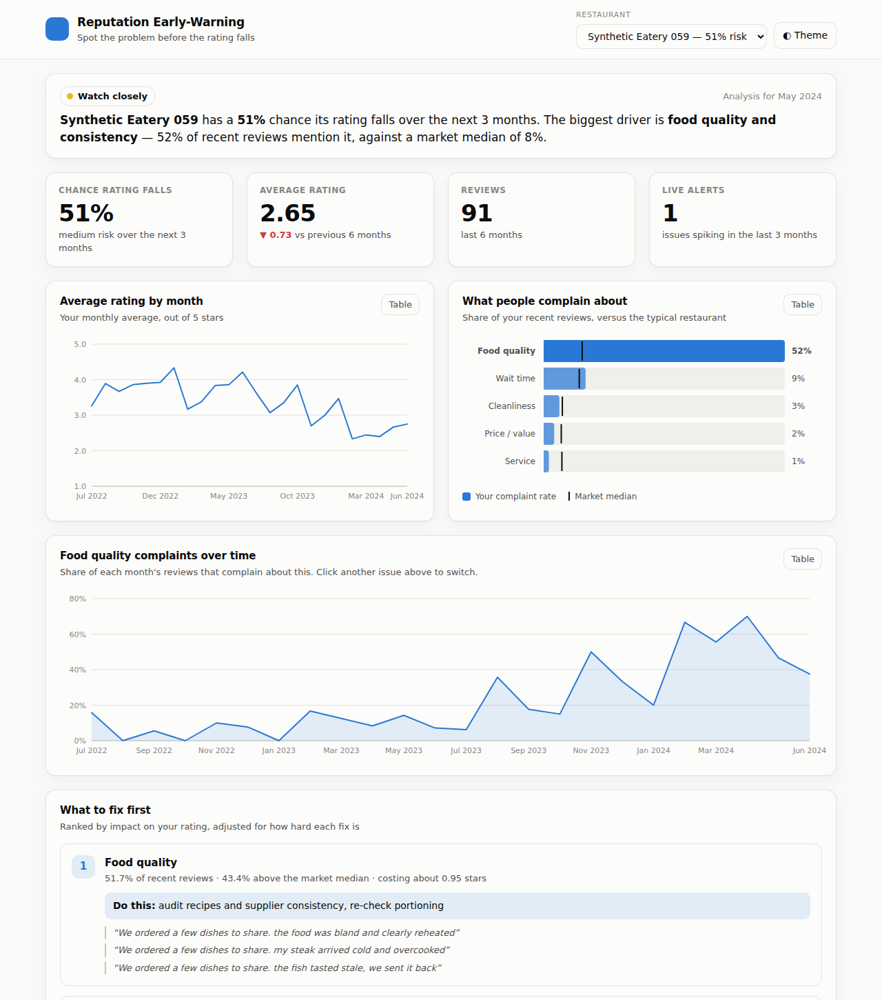

# Restaurant Reputation Early-Warning System

A reference implementation ("sample model") for the DSA2111 group project idea:
instead of a basic positive/negative sentiment classifier over Yelp reviews,
this system reads a restaurant's review stream and answers the question a
manager actually has —

> **Is my rating about to fall, why, and which operational problem should I fix first?**

Everything here runs end to end today: `make demo` trains the models on a
bundled simulator, `make serve` opens an owner-facing dashboard at
<http://localhost:8000>, and the same pipeline runs on the real
[Yelp Open Dataset](https://www.yelp.com/dataset) with `--source yelp`.



---

## 1. Why this is more than a sentiment model

| Plain sentiment model | This system |
| --- | --- |
| One score per review (positive/negative) | Multi-label **aspect** classification: service, food quality, cleanliness, price/value, wait time |
| Describes the past | **Detects** complaint rates breaking away from a venue's own baseline, and **predicts** rating decline 3 months ahead |
| Output is a chart | Output is a **ranked action list** with attributed risk, estimated star cost and verbatim evidence |
| Evaluated on review-level accuracy | Evaluated on *lead time* (how early the warning fires) and *precision@k* (the operating point a district manager actually uses) |

The claim being made — and tested in `tests/` — is that the star rating is a
**lagging** indicator, while the aspect-level complaint rate is a **leading**
one. The whole architecture follows from that.

---

## 2. System architecture

```
 Yelp reviews (JSON)            Module 1                  Module 2
 ┌──────────────────┐   ┌──────────────────────┐   ┌─────────────────────────┐
 │ business.json    │   │ Aspect classifier    │   │ Emerging-complaint      │
 │ review.json      ├──►│ weak supervision +   ├──►│ detector                │
 │  (or simulator)  │   │ TF-IDF → OvR logreg  │   │ EWMA + robust z-score   │
 └──────────────────┘   └──────────┬───────────┘   └────────────┬────────────┘
                                   │ per-review aspect flags    │ alerts
                                   ▼                            │
                        ┌──────────────────────┐                │
                        │ Business × month     │                │
                        │ panel builder        │                │
                        │ (leak-free windows)  │                │
                        └──────────┬───────────┘                │
                                   │                            │
              Module 3             ▼            Module 4        ▼
        ┌────────────────────────────────┐  ┌──────────────────────────────────┐
        │ Decline predictor              │  │ Cause summariser + prioritiser   │
        │ HistGradientBoosting +         ├─►│ counterfactual attribution,      │
        │ isotonic calibration           │  │ star-impact ridge, effort weights│
        └────────────────────────────────┘  └───────────────┬──────────────────┘
                                                            ▼
                                     FastAPI service  ·  Docker  ·  Kubernetes
                                     /alerts  /businesses/{id}/report  /analyse
```

### Module 1 — Aspect classification (`models/aspect_classifier.py`)
Yelp gives stars but no aspect labels, so the model is trained by **weak
supervision**: a seed lexicon produces noisy multi-labels, and a TF-IDF +
one-vs-rest logistic regression is fitted on them. The classifier generalises
past the lexicon while staying cheap enough to retrain nightly in a container.
Polarity comes from the star rating (`stars <= 2` → complaint), which is the
standard Yelp weak-labelling trick; its cost is quantified in the evaluation.

### Module 2 — Emerging complaint detection (`models/complaint_detector.py`)
Each (business, aspect) complaint-rate series is tracked with an EWMA baseline
and a **median-absolute-deviation** scale, giving a robust z-score. Robust
statistics matter here: complaint rates are bounded, skewed and spiky, so a
mean/σ control chart alerts on ordinary noise. Two guards suppress the classic
false positives — a burn-in period, and a minimum absolute complaint count so
"100% of 2 reviews" never fires.

### Module 3 — Rating-decline prediction (`models/decline_predictor.py`)
Binary classification on the business-month panel: will mean stars over months
*t+1…t+3* fall ≥ 0.2 below the trailing mean? Features are level, recent level,
**momentum** (Δ recent vs prior) and **peer-relative** versions of the same
quantities. Two rules are enforced in one place (`features/panel.py`) so they
can be audited: features use only months ≤ *t*, and the split is **chronological**
— a random split leaks the outcome and inflates AUC badly.

### Module 4 — Cause summary and prioritisation (`models/recommender.py`)
For each aspect the system asks the fitted predictor a counterfactual: *what
would this venue's risk be if this aspect sat at the market median and had
stopped deteriorating?* The drop in predicted probability is that aspect's
attributed risk. A separate ridge regression of monthly stars on complaint rates
gives a client-readable star cost ("cleanliness complaints cost ≈1.9 stars per
unit rate"). Priority = (attributed risk + ½ × star cost) ÷ effort weight, so
the recommendation trades impact against how hard the lever is to pull — and
every finding ships with three real review quotes as evidence.

---

## 3. Quickstart

### macOS / Linux

```bash
pip install -r requirements.txt
make demo                 # train on the simulator, then print the top-10 report
make test                 # 23 tests, ~10 seconds
make serve                # dashboard at http://localhost:8000 (API docs at /docs)
```

### Windows (PowerShell)

`make` is not available on Windows by default, so run the same commands
directly. The Makefile is only a shortcut for these.

```powershell
python -m venv .venv
.\.venv\Scripts\Activate.ps1
pip install -r requirements.txt

# Point Python at the package -- this is the one step the Makefile does for you.
# Re-run it in every new terminal session.
$env:PYTHONPATH = "src"

python -m pytest tests -q                                  # = make test
python -m reputation.pipeline.train --source synthetic `
    --n-businesses 120 --months 36                         # = make train
python -m reputation.pipeline.score --top 10               # = make score
python -m uvicorn reputation.api.main:app --reload --port 8000   # = make serve
```

If PowerShell refuses to run the activation script ("running scripts is
disabled on this system"), unblock it for that terminal only:
`Set-ExecutionPolicy -Scope Process -ExecutionPolicy Bypass`.

`pytest` finds the package without `PYTHONPATH` because `pyproject.toml` sets
it, but the `train` and `score` modules need the variable.

Against the real dataset (download and unpack Yelp's JSON into `./data`):

```bash
python -m reputation.pipeline.train --source yelp --city Philadelphia
python -m reputation.pipeline.score --top 20 --out artifacts/reports.json
```

Containers:

```bash
docker compose up --build         # builds, runs tests, trains, serves on :8000
kubectl apply -f k8s/deployment.yaml
```

The image is multi-stage: the builder runs the test suite and trains the model
bundle, the runtime stage carries only the serving code plus the bundle, runs as
a non-root user, and exposes `/health` for readiness/liveness probes. A
`CronJob` retrains nightly onto a shared volume.

### Sample output

```json
{
  "business_id": "syn_b0059",
  "period": "2024-05",
  "decline_risk": 0.5051,
  "risk_band": "medium",
  "summary": "51% probability of a rating decline over the next 3 months. Largest
              attributable driver is food quality and consistency (52% of recent
              reviews complain, market median 8%). First action: audit recipes and
              supplier consistency, re-check portioning.",
  "findings": [
    {
      "aspect": "food_quality",
      "complaint_rate": 0.5169, "market_median": 0.0826, "trend": 0.1682,
      "attributed_risk": 0.1137, "estimated_star_cost": 0.948,
      "priority_score": 0.4197,
      "suggested_action": "audit recipes and supplier consistency, re-check portioning",
      "evidence": ["the food was bland and clearly reheated", "my steak arrived cold and overcooked"]
    }
  ]
}
```

---

## 4. The dashboard

`make serve` (or `docker compose up`) serves a single-page dashboard at
<http://localhost:8000> aimed at a restaurant owner rather than an analyst. It
answers the four questions an owner has, in the order they ask them:

| Question | What the page shows |
| --- | --- |
| Am I in trouble? | A plain-English verdict line, a risk band (dot **and** written label), and four headline tiles: decline risk, average rating with its 6-month delta, review volume, live alerts |
| Is my rating moving? | Monthly average rating, with gaps where nobody reviewed instead of an interpolated line |
| What are people complaining about? | Complaint rate per issue as bars, each with a tick marking the **market median**, so "is this bad?" is answerable at a glance |
| Is it getting worse? | Click any issue to see its complaint rate month by month |
| What do I do on Monday? | Ranked action cards: the issue, how far above the market it sits, the estimated star cost, a concrete first action, and three real customer quotes as evidence |

Design and engineering notes worth repeating in the report:

- **No build step, no CDN, no framework.** The page is three static files served
  by the existing FastAPI app (`src/reputation/api/static/`). That keeps the
  serving tier one container, works with no internet access during a live demo,
  and adds zero Python dependencies.
- **One data hue for every mark.** Colour never encodes rank, and status
  (risk band, alert severity) always pairs a colour with a written label, so
  nothing is readable by colour alone.
- **Every chart has a table view** (the `Table` button) and the page ships a
  validated dark mode, a keyboard skip link, and a layout that holds at phone
  width.
- **The dashboard and the batch reports call the same functions**, so the screen
  can never disagree with `artifacts/reports.json`.

Endpoints behind it: `/businesses`, `/businesses/{id}/report`,
`/businesses/{id}/history`, `/businesses/{id}/aspects`, `/alerts`. The
interactive API explorer is still at `/docs`.

## 5. Results on the bundled simulator

120 venues × 36 months ≈ 71.6k reviews, 3,600 business-months, final 6 months
held out chronologically (`artifacts/metrics.json` after `make train`):

| Metric (held-out) | Current-negativity baseline | Majority baseline | **This system** |
| --- | --- | --- | --- |
| ROC-AUC | 0.531 | 0.500 | **0.703** |
| PR-AUC (base rate 0.244) | 0.256 | 0.244 | **0.521** |
| Precision@20 | 0.10 | 0.24 | **0.95** |
| Brier score (lower better) | 0.210 | — | **0.158** |

Early-warning behaviour against the simulator's injected degradation events
(46 events): **100% detected**, **median lead time 3 months**, and **96% fired
before the rating drop became visible** in the star average.

> **Read these numbers as a working demonstration, not as the paper's results.**
> The simulator was written to contain the effect the system looks for, so it
> validates that the pipeline *works*; the report's Section 4 numbers must come
> from `--source yelp` on the real corpus, where aspect labels are noisier and
> lead times will be shorter. The one number that is honest on synthetic data is
> the *relative* gap between the model and the baselines, since both see the same
> data.

Top permutation-importance features on the held-out slice: `hist_mean_stars`,
`recent_negative_rate`, `delta_negative_rate`, `recent_complaint_rate_cleanliness`,
`peer_hist_negative_rate` — i.e. level, momentum and peer-relative signals all
contribute, which is the empirical argument for the panel design.

---

## 6. Repository layout

```
src/reputation/
  config.py                    all hyper-parameters in one frozen dataclass
  data/loader.py               Yelp JSON streaming + synthetic corpus generator
  features/panel.py            business×month panel, leak-free windows, labels
  models/aspect_classifier.py  Module 1
  models/complaint_detector.py Module 2
  models/decline_predictor.py  Module 3
  models/recommender.py        Module 4 (+ report contract)
  evaluation/metrics.py        ranking metrics, baselines, lead-time analysis
  pipeline/train.py            CLI: data → fitted bundle + metrics.json
  pipeline/score.py            CLI: bundle → early-warning reports
  api/main.py                  FastAPI service
  api/static/                  the owner dashboard (index.html, css, js)
tests/                         pipeline + API tests (the CI gate in the image)
Dockerfile, docker-compose.yml, k8s/deployment.yaml
```

## 7. Mapping to the assessment criteria

| Criterion | Where it lives |
| --- | --- |
| Working prototype / user value | The dashboard (`api/static/`) plus `pipeline/score.py` — an owner-facing screen with ranked actions and evidence |
| Use of AI + data analytics | Modules 1–4: weak-supervised text classification, robust anomaly detection, gradient boosting, counterfactual attribution |
| Cloud / Docker / Kubernetes | Multi-stage `Dockerfile`, `docker-compose.yml`, Deployment + Service + nightly `CronJob` |
| Code quality, structure, documentation | One module per pipeline stage, frozen config, module- and function-level docstrings explaining *why*, 23 automated tests |
| Report Section 3 (system design) | This README's architecture section maps 1:1 onto the modules |
| Report Section 4 (evaluation) | `evaluation/metrics.py` + `artifacts/metrics.json` |

## 8. Known limitations (state these in the report)

1. **Weak labels are noisy.** A 1-star review mentioning two aspects is counted
   as complaining about both. A hand-labelled sample of ~500 reviews would give
   a true precision/recall figure for Module 1 — worth doing for the report.
2. **Attribution is associational.** The counterfactual is an intervention on
   the *model*, not a causal effect; it ranks actions well under a stable
   environment but does not prove that fixing an aspect raises the rating.
3. **Star polarity ≠ aspect polarity.** A dedicated aspect-based sentiment model
   (e.g. a fine-tuned transformer) is the natural upgrade, and the
   `AspectClassifier` interface was kept model-agnostic so it can be swapped in
   for a side-by-side comparison in Section 4.
4. **Yelp reviews are self-selected and bursty**, and the dataset ends in a
   fixed year, so absolute lead times will differ from a live review feed.
5. **Cold-start venues** (< 8 reviews in the trailing window) are excluded
   rather than scored badly; serving them needs a hierarchical/market-prior model.

## 9. Suggested next steps for the group

- Run `--source yelp` on 2–3 cities and regenerate the Section 4 tables.
- Hand-label a review sample to measure Module 1 properly, and add a
  DistilBERT variant behind the same interface for the comparison table.
- Extend the dashboard: a portfolio view for chain operators (all venues at
  once) and an email/Slack digest driven by the same alert feed.
- Write the related-work review (25–30 references): aspect-based sentiment
  analysis, review helpfulness/rating dynamics, statistical process control for
  service quality, and churn-style early-warning systems.
